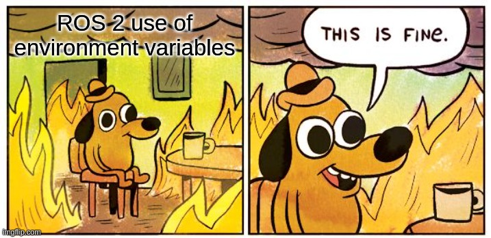

# ROS 2 Tips & Tricks


## Content

<!-- START doctoc generated TOC please keep comment here to allow auto update -->
<!-- DON'T EDIT THIS SECTION, INSTEAD RE-RUN doctoc TO UPDATE -->

- [DDS](#dds)
	- [ROS_DOMAIN_ID](#ros_domain_id)
	- [Changing DDS vendor](#changing-dds-vendor)
	- [Low-level DDS config](#low-level-dds-config)
- [Autocompletion and IDEs](#autocompletion-and-ides)
- [Aliases](#aliases)
- [Note about environment variables](#note-about-environment-variables)
- [colcon](#colcon)
	- [Always separate building and running terminal](#always-separate-building-and-running-terminal)
	- [Do a clean build](#do-a-clean-build)
	- [Useful extensions](#useful-extensions)
	- [Autocompletion](#autocompletion)
	- [Listing the packages found by colcon](#listing-the-packages-found-by-colcon)
	- [Overlays and underlays](#overlays-and-underlays)
- [TODO: Cover more topics](#todo-cover-more-topics)

<!-- END doctoc generated TOC please keep comment here to allow auto update -->


## DDS


### ROS_DOMAIN_ID

You should choose a unique [ROS_DOMAIN_ID](https://docs.ros.org/en/rolling/Concepts/About-Domain-ID.html).
```bash
# ROS_DOMAIN_ID: The domain ID is used to segment the network in order to avoid interference
# between different groups of computers running ROS 2 on the same local area network.
# Machines with different domain IDs will not talk, nor interfere, with each other.
# see https://docs.ros.org/en/rolling/Concepts/About-Domain-ID.html
# Simply choose a domain ID between 0 and 101, inclusive.
export ROS_DOMAIN_ID=53
```


### Changing DDS vendor

See [About different ROS 2 DDS/RTPS vendors](https://docs.ros.org/en/rolling/Concepts/About-Different-Middleware-Vendors.html)
in the ROS 2 docs.

```bash
export RMW_IMPLEMENTATION="rmw_fastrtps_cpp"
```


### Low-level DDS config

Low-level DDS config: See [dds](./dds/).


## Autocompletion and IDEs

Please refer to the 👉 [Using VSCode and JetBrains IDEs (CLion, PyCharm) with ROS](./ide/README.md) 👈.


## Aliases

Useful Bash aliases for your `.bashrc`:
```bash
alias ws-clean='rm -rf build/ install/ log/ .env'
alias ws-clean-all='rm -rf build/ install/ log/ .env .vscode/ python.local.sh compile_commands.json'
alias g='source /opt/ros/galactic/setup.bash'
alias h='source /opt/ros/humble/setup.bash'
alias h='source /opt/ros/rolling/setup.bash'
# `s` as an alias for ROS 2 and ROS 1 compatible sourcing of setup.bash
s() {
	if [[ -f install/setup.bash ]]; then
		source install/setup.bash
		return 0
	fi
	if [[ -f devel/setup.bash ]]; then
		source devel/setup.bash
		return 0
	fi
	echo "No setup.bash found!" 1>&2
	return 1
}
# `sl` as an alias for ROS 2 and ROS 1 compatible sourcing of setup_local.bash
sl() {
	if [[ -f install/setup_local.bash ]]; then
		source install/setup_local.bash
		return 0
	fi
	if [[ -f devel/setup_local.bash ]]; then
		source devel/setup_local.bash
		return 0
	fi
	echo "No setup_local.bash found!" 1>&2
	return 1
}
```


## Note about environment variables

ROS relies heavily on the environment variables. Sourcing the setup files of the workspaces change different environment
variables which affect both build and runtime.

<p align="center">

</p>

A lot of these environment variables are actually ordered list of _paths_ (directories) with items separated using `:`.
Order of the directories in which they are specified determines their priority during search (the order in which they
are examined, where the first dir specified is examined first).

Some of the most important env variables modified by ROS setup files include:
* `PATH` – affects where binaries are looked for
* `LD_LIBRARY_PATH` (Linux), `DYLD_LIBRARY_PATH` (macOS) – dynamic linker path which affects where the for the dynamic
  libraries
* `PYTHONPATH` – affects where Python looks for modules (how imports are resolved)
* `CMAKE_PREFIX_PATH` – affects where CMake looks for packages when resolving any dependencies
* `AMENT_PREFIX_PATH`
* `COLCON_PREFIX_PATH`

When sourcing a workspace, new paths get prepended to the current ones. That's how [overlays](#overlays-and-underlays)
work.

Most importantly, the environment variables that are set during a build affects the results and the resulting setup
file. That's the reason why you always have to use separate terminal
for [building the workspace](#always-separate-building-and-running-terminal).


## colcon


### Always separate building and running terminal

Always use at least two (clean) terminals.

One for building the workspace (where you source only the ROS 2 or different relevant underlay).

The other one(s) for sourcing the built workspace and running the nodes.

This way you can prevent polluting the environment (changing environment variables) of the build terminal by the built
sourced workspace and prevent serious issues.


### Do a clean build

If build keeps failing (or even time to time), it might be good to clean all build artifacts and perform a clean build:
```bash
# clean build artifacts
rm -rf build/ install/ log/
# do a clean build (append any arguments you want)
colcon build
```

I recommend creating an alias for `rm -rf build/ install/ log/`, see [Aliases](#aliases).


### Useful extensions

Instead of having to type long arguments over and over (such
as `--cmake-args -DCMAKE_EXPORT_COMPILE_COMMANDS=ON --no-warn-unused-cli`), you can use
[colcon mixin](https://colcon.readthedocs.io/en/released/reference/verb/mixin.html) with
the [default colcon mixin repository](https://github.com/colcon/colcon-mixin-repository/).

If you've never used colcon mixins before, you'll have to do an initial set up:
```bash
# 1. install colcon mixin plugin via apt
sudo apt install python3-colcon-mixin
# or via pip
python3 -m pip install -U colcon-mixin
# 2. add default mixins repository and download the mixins from it
#    see https://github.com/colcon/colcon-mixin-repository/
colcon mixin add default https://raw.githubusercontent.com/colcon/colcon-mixin-repository/master/index.yaml
colcon mixin update default
```

Then, you can use for example the `compile-commands` (which expands
to `--cmake-args -DCMAKE_EXPORT_COMPILE_COMMANDS=ON --no-warn-unused-cli`) mixin like this:
```bash
colcon build --mixin compile-commands
```

Another useful set of mixins are `debug`, `rel-with-deb-info`, and `release`, which are shortcuts
for `--cmake-args -DCMAKE_BUILD_TYPE=Debug/RelWithDebInfo/Release`, respectively.


### Autocompletion

colcon can autocomplete packages' names for `--packages-up-to`, `--packages-select`, and similar in shell
(Bash and zsh). This is very helpful because it is hard to remember (and type correctly) the long package names. The
instructions for enabling it can be
found [here](https://colcon.readthedocs.io/en/released/user/installation.html#enable-completion).

Or you can copy and paste the following snippet into your `~/.bashrc`. Apart from enabling the autocompletion, it
configures few other useful things:
```bash
# see https://colcon.readthedocs.io/en/released/user/installation.html#enable-completion
if [[ -f /usr/share/colcon_argcomplete/hook/colcon-argcomplete.bash ]]; then
	source /usr/share/colcon_argcomplete/hook/colcon-argcomplete.bash
fi
# see https://colcon.readthedocs.io/en/released/user/installation.html#quick-directory-changes
if [[ -f /usr/share/colcon_cd/function/colcon_cd.sh ]]; then
	source /usr/share/colcon_cd/function/colcon_cd.sh
fi
# disable colcon desktop notifications by default (system-wide)
# see https://github.com/colcon/colcon-notification/issues/31
# also note:
#   /usr/lib/python3/dist-packages/colcon_core/entry_point.py:152:
#     UserWarning: The environment variable 'COLCON_EXTENSION_BLACKLIST' has been deprecated,
#     use 'COLCON_EXTENSION_BLOCKLIST' instead
export COLCON_EXTENSION_BLOCKLIST="colcon_core.event_handler.desktop_notification"
```


### Listing the packages found by colcon

```bash
colcon list | column -t
```

If you specify the `--topological-order` option, the packages will be ordered topologically (breadth-first) by their
mutual dependency relationships. The first listed package will be the one that does not have any dependencies on the
packages in the current workspace, while the last one might be (but does not have to be) dependent on all packages in
the current workspace.

Additionally, you can also specify any package selection arguments (such as `--packages-up-to`, `--packages-select`) to
filter the output.

You can even visualize the dependency graph (which must be a DAG in order for the workspace to be buildable)
using `colcon graph`.


### Overlays and underlays

👉 **See the great
article [Using Multiple Workspaces](https://colcon.readthedocs.io/en/released/user/using-multiple-workspaces.html)** in
colcon docs.

Workspaces can be stacked on top of each other. Then, they are called _overlays_ or _underlays_ according to their
respective mutual relationships.

Consider the following example:
```
workspace A
└── workspace B
    └── workspace C
```

The _workspace A_ is the bottom-most workspace. It's an underlay of workspaces B and C.

The _workspace B_ is an overlay of the _workspace A_. All packages from _workspace A_ are available in workspace B as
well. If the _workspace B_ has some packages with the same names as in _workspace A_, _workspace B_'s packages take
precedence and override those from _workspace A_. However, overriding the packages
[might not behave correctly in all situations](https://colcon.readthedocs.io/en/released/user/overriding-packages.html).

Analogically, all packages from _workspace A_ and _workspace B_ are available in top-most _workspace C_.

The process of overlaying is done by sourcing the underlay's setup file when building its overlay. In our case, we would
do the following to create the _workspace C_:
1. Build terminal for _workspace A_ in its root dir:
   ```bash
   colcon build
   ```
2. Build terminal for _workspace B_ in its root dir:
   ```bash
   source path/to/workspace_A/install/setup.bash
   colcon build
   ```
3. Build terminal for _workspace C_ in its root dir:
   ```bash
   source path/to/workspace_B/install/setup.bash
   colcon build
   ```
4. Run terminal for _workspace C_ in its root dir:
   ```bash
   source path/to/workspace_C/install/setup.bash
   # here we can access and run everything from all of the workspaces
   ```


## TODO: Cover more topics

TODO: I have some tips and tricks about the following topics I need to write up:

* DDS
	* distributed discovery vs centralized registry
	* QoS, when different settings are not compatible and how it affects the system (communication not working)
	* ros2 CLI appears to not work → restarting ros2 daemon
* organizing and using external code and packages
	* apt packages
	* sources-only packages
	* vcstool and related tools
* warn about colcon --symlink-install behavior
	* pure Python packages
	* files vs. directories
	* added and removed files
* speeding up colcon build using `--packages-select` (or `--packages-up-to`)
* handling parameters at scale (using asterisk `*` in params files)
